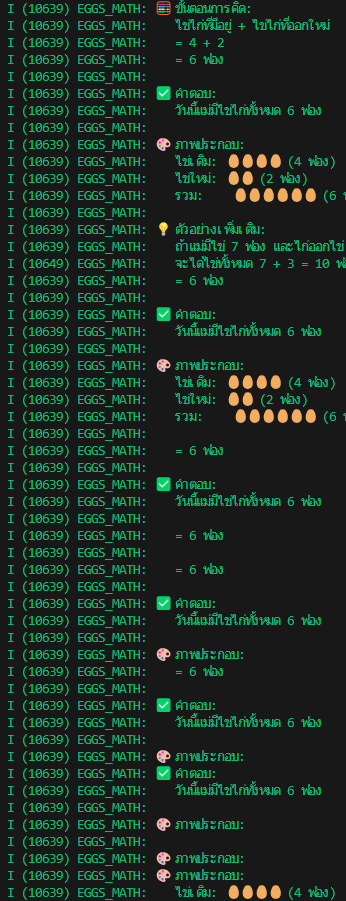
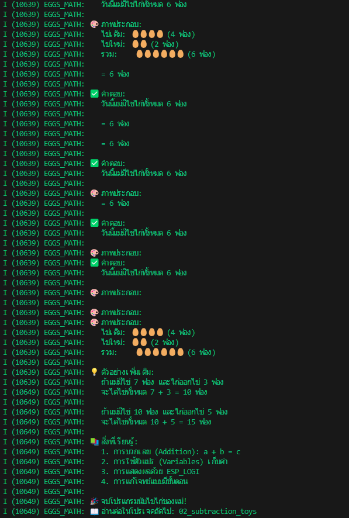

I (10639) EGGS_MATH: 🧮 ขั้นตอนการคิด:
I (10639) EGGS_MATH:    ไข่ไก่ที่มีอยู่ + ไข่ไก่ที่ออกใหม่
I (10639) EGGS_MATH:    = 4 + 2
I (10639) EGGS_MATH:    = 6 ฟอง
I (10639) EGGS_MATH: 
I (10639) EGGS_MATH: ✅ คำตอบ:
I (10639) EGGS_MATH:    วันนี้แม่มีไข่ไก่ทั้งหมด 6 ฟอง
I (10639) EGGS_MATH:
I (10639) EGGS_MATH: 🎨 ภาพประกอบ:
I (10639) EGGS_MATH:    ไข่เดิม: 🥚🥚🥚🥚 (4 ฟอง)
I (10639) EGGS_MATH:    ไข่ใหม่: 🥚🥚 (2 ฟอง)
I (10639) EGGS_MATH:    รวม:    🥚🥚🥚🥚🥚🥚 (6 ฟอง)
I (10639) EGGS_MATH:
I (10639) EGGS_MATH: 💡 ตัวอย่างเพิ่มเติม:
I (10639) EGGS_MATH:    ถ้าแม่มีไข่ 7 ฟอง และไก่ออกไข่ 3 ฟอง
I (10649) EGGS_MATH:    จะได้ไข่ทั้งหมด 7 + 3 = 10 ฟอง
I (10649) EGGS_MATH:
I (10649) EGGS_MATH:    ถ้าแม่มีไข่ 10 ฟอง และไก่ออกไข่ 5 ฟอง
I (10649) EGGS_MATH:    จะได้ไข่ทั้งหมด 10 + 5 = 15 ฟอง
I (10649) EGGS_MATH:
I (10649) EGGS_MATH: 📚 สิ่งที่เรียนรู้:
I (10649) EGGS_MATH:    1. การบวกเลข (Addition): a + b = c
I (10649) EGGS_MATH:    2. การใช้ตัวแปร (Variables) เก็บค่า
I (10649) EGGS_MATH:    3. การแสดงผลด้วย ESP_LOGI
I (10649) EGGS_MATH:    4. การแก้โจทย์แบบมีขั้นตอน
I (10649) EGGS_MATH:
I (10649) EGGS_MATH: 🎉 จบโปรแกรมนับไข่ไก่ของแม่!
I (10649) EGGS_MATH: 📖 อ่านต่อในโปรเจคถัดไป: 02_subtraction_toys
I (12649) main_task: Returned from app_main()

