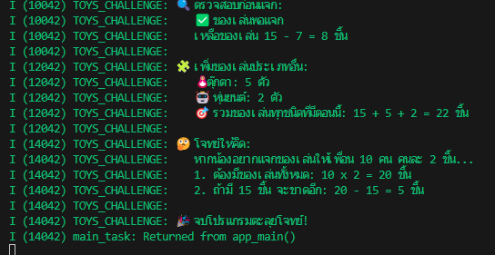

I (10042) TOYS_CHALLENGE: 🔍 ตรวจสอบก่อนแจก:
I (10042) TOYS_CHALLENGE:    ✅ ของเล่นพอแจก
I (10042) TOYS_CHALLENGE:    เหลือของเล่น 15 - 7 = 8 ชิ้น
I (10042) TOYS_CHALLENGE:
I (12042) TOYS_CHALLENGE: 🧩 เพิ่มของเล่นประเภทอื่น:
I (12042) TOYS_CHALLENGE:    🪆 ตุ๊กตา: 5 ตัว
I (12042) TOYS_CHALLENGE:    🤖 หุ่นยนต์: 2 ตัว
I (12042) TOYS_CHALLENGE:    🎯 รวมของเล่นทุกชนิดที่มีตอนนี้: 15 + 5 + 2 = 22 ชิ้น
I (12042) TOYS_CHALLENGE:
I (14042) TOYS_CHALLENGE: 🤔 โจทย์ให้คิด:
I (14042) TOYS_CHALLENGE:    หากน้องอยากแจกของเล่นให้เพื่อน 10 คน คนละ 2 ชิ้น...
I (14042) TOYS_CHALLENGE:    1. ต้องมีของเล่นทั้งหมด: 10 x 2 = 20 ชิ้น
I (14042) TOYS_CHALLENGE:    2. ถ้ามี 15 ชิ้น จะขาดอีก: 20 - 15 = 5 ชิ้น
I (14042) TOYS_CHALLENGE: 
I (14042) TOYS_CHALLENGE: 🎉 จบโปรแกรมตะลุยโจทย์!
I (14042) main_task: Returned from app_main()

