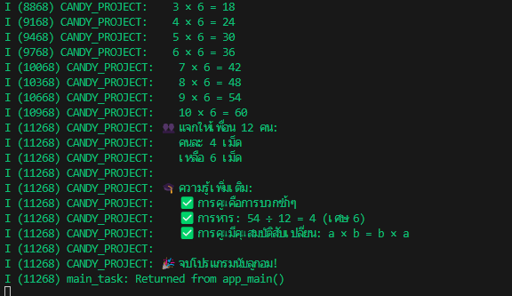

I (8868) CANDY_PROJECT:    3 × 6 = 18
I (9168) CANDY_PROJECT:    4 × 6 = 24
I (9468) CANDY_PROJECT:    5 × 6 = 30
I (9768) CANDY_PROJECT:    6 × 6 = 36
I (10068) CANDY_PROJECT:    7 × 6 = 42
I (10368) CANDY_PROJECT:    8 × 6 = 48
I (10668) CANDY_PROJECT:    9 × 6 = 54
I (10968) CANDY_PROJECT:    10 × 6 = 60
I (11268) CANDY_PROJECT: 👥 แจกให้เพื่อน 12 คน:
I (11268) CANDY_PROJECT:    คนละ 4 เม็ด
I (11268) CANDY_PROJECT:    เหลือ 6 เม็ด
I (11268) CANDY_PROJECT:
I (11268) CANDY_PROJECT: 🎓 ความรู้เพิ่มเติม:
I (11268) CANDY_PROJECT:    ✅ การคูณคือการบวกซ้ำๆ
I (11268) CANDY_PROJECT:    ✅ การหาร: 54 ÷ 12 = 4 (เศษ 6)
I (11268) CANDY_PROJECT:    ✅ การคูณมีคุณสมบัติสับเปลี่ยน: a × b = b × a
I (11268) CANDY_PROJECT: 
I (11268) CANDY_PROJECT: 🎉 จบโปรแกรมนับลูกอม!
I (11268) main_task: Returned from app_main()

