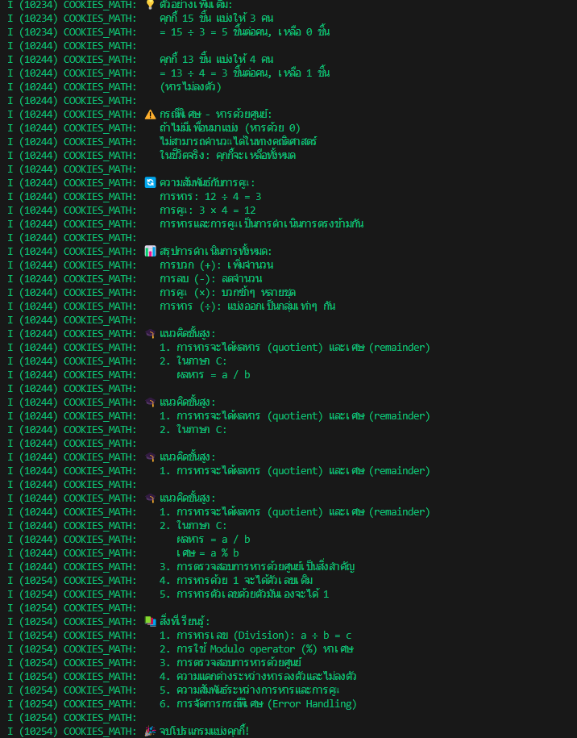

I (10224) COOKIES_MATH: 🧮 ขั้นตอนการคิด:
I (10224) COOKIES_MATH:    คุกกี้ทั้งหมด ÷ จำนวนเพื่อน
I (10224) COOKIES_MATH:    = 12 ÷ 4
I (10224) COOKIES_MATH:    = 3 ชิ้นต่อคน
I (10224) COOKIES_MATH:
I (10224) COOKIES_MATH: ✅ คำตอบ:
I (10224) COOKIES_MATH:    แต่ละคนได้คุกกี้ 3 ชิ้น
I (10224) COOKIES_MATH:    แบ่งได้พอดี ไม่มีเหลือ
I (10224) COOKIES_MATH: 
I (10224) COOKIES_MATH: 🎨 ภาพประกอบการแบ่ง:
I (10224) COOKIES_MATH:    คุกกี้ทั้งหมด: 🍪🍪🍪🍪🍪🍪🍪🍪🍪🍪🍪🍪 (12 ชิ้น)
I (10224) COOKIES_MATH:
I (10224) COOKIES_MATH:    เพื่อนคนที่ 1: 
I (10224) COOKIES_MATH: 🍪🍪🍪 (3 ชิ้น)
I (10224) COOKIES_MATH:    เพื่อนคนที่ 2: 
I (10234) COOKIES_MATH: 🍪🍪🍪 (3 ชิ้น)
I (10234) COOKIES_MATH:    เพื่อนคนที่ 3: 
I (10234) COOKIES_MATH: 🍪🍪🍪 (3 ชิ้น)
I (10234) COOKIES_MATH:    เพื่อนคนที่ 4: 
I (10234) COOKIES_MATH: 🍪🍪🍪 (3 ชิ้น)
I (10234) COOKIES_MATH:
I (10234) COOKIES_MATH: 💡 ตัวอย่างเพิ่มเติม:
I (10234) COOKIES_MATH:    คุกกี้ 15 ชิ้น แบ่งให้ 3 คน
I (10234) COOKIES_MATH:    = 15 ÷ 3 = 5 ชิ้นต่อคน, เหลือ 0 ชิ้น
I (10244) COOKIES_MATH: 
I (10244) COOKIES_MATH:    คุกกี้ 13 ชิ้น แบ่งให้ 4 คน
I (10244) COOKIES_MATH:    = 13 ÷ 4 = 3 ชิ้นต่อคน, เหลือ 1 ชิ้น
I (10244) COOKIES_MATH:    (หารไม่ลงตัว)
I (10244) COOKIES_MATH:
I (10244) COOKIES_MATH: ⚠️  กรณีพิเศษ - หารด้วยศูนย์:
I (10244) COOKIES_MATH:    ถ้าไม่มีเพื่อนมาแบ่ง (หารด้วย 0)
I (10244) COOKIES_MATH:    ไม่สามารถคำนวณได้ในทางคณิตศาสตร์
I (10244) COOKIES_MATH:    ในชีวิตจริง: คุกกี้จะเหลือทั้งหมด
I (10244) COOKIES_MATH:
I (10244) COOKIES_MATH: 🔄 ความสัมพันธ์กับการคูณ:
I (10244) COOKIES_MATH:    การหาร: 12 ÷ 4 = 3
I (10244) COOKIES_MATH:    การคูณ: 3 × 4 = 12
I (10244) COOKIES_MATH:    การหารและการคูณเป็นการดำเนินการตรงข้ามกัน
I (10244) COOKIES_MATH:
I (10244) COOKIES_MATH: 📊 สรุปการดำเนินการทั้งหมด:
I (10244) COOKIES_MATH:    การบวก (+): เพิ่มจำนวน
I (10244) COOKIES_MATH:    การลบ (-): ลดจำนวน
I (10244) COOKIES_MATH:    การคูณ (×): บวกซ้ำๆ หลายชุด
I (10244) COOKIES_MATH:    การหาร (÷): แบ่งออกเป็นกลุ่มเท่าๆ กัน
I (10244) COOKIES_MATH:
I (10244) COOKIES_MATH: 🎓 แนวคิดขั้นสูง:
I (10244) COOKIES_MATH:    1. การหารจะได้ผลหาร (quotient) และเศษ (remainder)
I (10244) COOKIES_MATH:    2. ในภาษา C:
I (10244) COOKIES_MATH:       ผลหาร = a / b
I (10244) COOKIES_MATH:       เศษ = a % b
I (10244) COOKIES_MATH:    3. การตรวจสอบการหารด้วยศูนย์เป็นสิ่งสำคัญ
I (10254) COOKIES_MATH:    4. การหารด้วย 1 จะได้ตัวเลขเดิม
I (10254) COOKIES_MATH:    5. การหารตัวเลขด้วยตัวมันเองจะได้ 1
I (10254) COOKIES_MATH:
I (10254) COOKIES_MATH: 📚 สิ่งที่เรียนรู้:
I (10254) COOKIES_MATH:    1. การหารเลข (Division): a ÷ b = c
I (10254) COOKIES_MATH:    2. การใช้ Modulo operator (%) หาเศษ
I (10254) COOKIES_MATH:    3. การตรวจสอบการหารด้วยศูนย์
I (10254) COOKIES_MATH:    4. ความแตกต่างระหว่างหารลงตัวและไม่ลงตัว
I (10254) COOKIES_MATH:    5. ความสัมพันธ์ระหว่างการหารและการคูณ
I (10254) COOKIES_MATH:    6. การจัดการกรณีพิเศษ (Error Handling)
I (10254) COOKIES_MATH:
I (10254) COOKIES_MATH: 🎉 จบโปรแกรมแบ่งคุกกี้!
I (10264) COOKIES_MATH: 📖 อ่านต่อในโปรเจคถัดไป: 05_mixed_shopping
I (12264) main_task: Returned from app_main()

