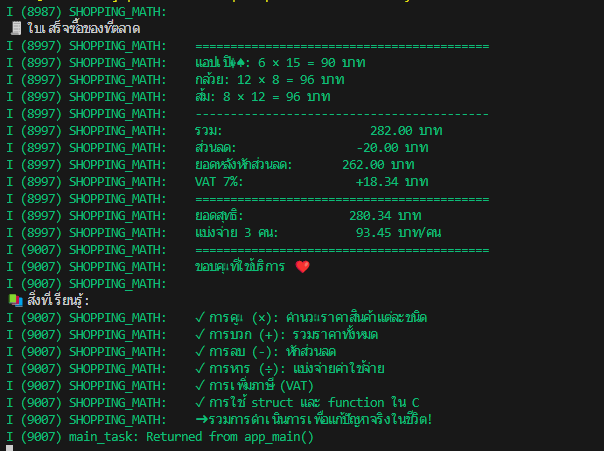

I (8987) SHOPPING_MATH: 
🧾 ใบเสร็จซื้อของที่ตลาด
I (8997) SHOPPING_MATH:    ==========================================
I (8997) SHOPPING_MATH:    แอปเปิ�♠: 6 × 15 = 90 บาท
I (8997) SHOPPING_MATH:    กล้วย: 12 × 8 = 96 บาท
I (8997) SHOPPING_MATH:    ส้ม: 8 × 12 = 96 บาท
I (8997) SHOPPING_MATH:    ------------------------------------------
I (8997) SHOPPING_MATH:    รวม:                     282.00 บาท
I (8997) SHOPPING_MATH:    ส่วนลด:                 -20.00 บาท
I (8997) SHOPPING_MATH:    ยอดหลังหักส่วนลด:       262.00 บาท
I (8997) SHOPPING_MATH:    VAT 7%:                +18.34 บาท
I (8997) SHOPPING_MATH:    ==========================================
I (8997) SHOPPING_MATH:    ยอดสุทธิ:               280.34 บาท
I (8997) SHOPPING_MATH:    แบ่งจ่าย 3 คน:           93.45 บาท/คน
I (9007) SHOPPING_MATH:    ==========================================
I (9007) SHOPPING_MATH:    ขอบคุณที่ใช้บริการ ❤️
I (9007) SHOPPING_MATH: 
📚 สิ่งที่เรียนรู้:
I (9007) SHOPPING_MATH:    ✓ การคูณ (×): คำนวณราคาสินค้าแต่ละชนิด
I (9007) SHOPPING_MATH:    ✓ การบวก (+): รวมราคาทั้งหมด
I (9007) SHOPPING_MATH:    ✓ การลบ (-): หักส่วนลด
I (9007) SHOPPING_MATH:    ✓ การหาร (÷): แบ่งจ่ายค่าใช้จ่าย
I (9007) SHOPPING_MATH:    ✓ การเพิ่มภาษี (VAT)
I (9007) SHOPPING_MATH:    ✓ การใช้ struct และ function ใน C
I (9007) SHOPPING_MATH:    ➜ รวมการดำเนินการเพื่อแก้ปัญหาจริงในชีวิต!
I (9007) main_task: Returned from app_main() 

