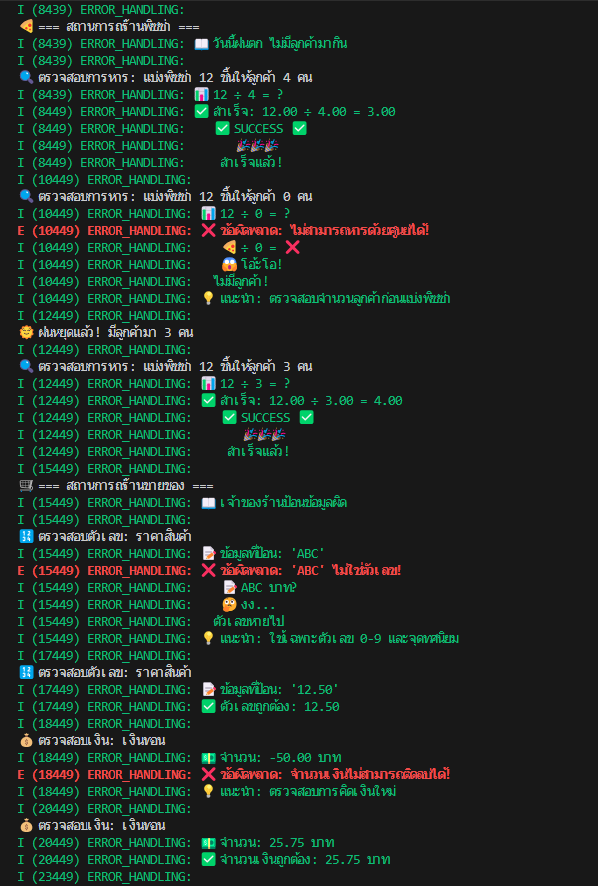
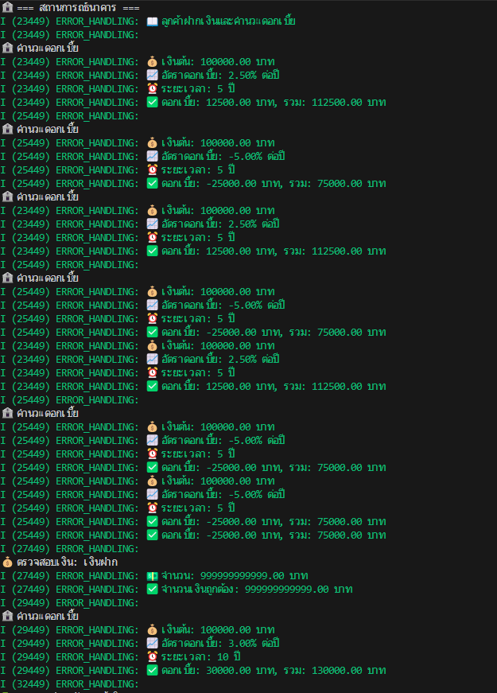

I (8439) ERROR_HANDLING: 
🍕 === สถานการณ์ร้านพิซซ่า ===
I (8439) ERROR_HANDLING: 📖 วันนี้ฝนตก ไม่มีลูกค้ามากิน
I (8439) ERROR_HANDLING: 
🔍 ตรวจสอบการหาร: แบ่งพิซซ่า 12 ชิ้นให้ลูกค้า 4 คน
I (8439) ERROR_HANDLING: 📊 12 ÷ 4 = ?
I (8449) ERROR_HANDLING: ✅ สำเร็จ: 12.00 ÷ 4.00 = 3.00
I (8449) ERROR_HANDLING:    ✅ SUCCESS ✅
I (8449) ERROR_HANDLING:       🎉🎉🎉
I (8449) ERROR_HANDLING:     สำเร็จแล้ว!
I (10449) ERROR_HANDLING: 
🔍 ตรวจสอบการหาร: แบ่งพิซซ่า 12 ชิ้นให้ลูกค้า 0 คน
I (10449) ERROR_HANDLING: 📊 12 ÷ 0 = ?
E (10449) ERROR_HANDLING: ❌ ข้อผิดพลาด: ไม่สามารถหารด้วยศูนย์ได้!
I (10449) ERROR_HANDLING:    🍕 ÷ 0 = ❌
I (10449) ERROR_HANDLING:    😱 โอ้ะโอ!
I (10449) ERROR_HANDLING:   ไม่มีลูกค้า!
I (10449) ERROR_HANDLING: 💡 แนะนำ: ตรวจสอบจำนวนลูกค้าก่อนแบ่งพิซซ่า
I (12449) ERROR_HANDLING: 
🌞 ฝนหยุดแล้ว! มีลูกค้ามา 3 คน
I (12449) ERROR_HANDLING: 
🔍 ตรวจสอบการหาร: แบ่งพิซซ่า 12 ชิ้นให้ลูกค้า 3 คน
I (12449) ERROR_HANDLING: 📊 12 ÷ 3 = ?
I (12449) ERROR_HANDLING: ✅ สำเร็จ: 12.00 ÷ 3.00 = 4.00
I (12449) ERROR_HANDLING:    ✅ SUCCESS ✅
I (12449) ERROR_HANDLING:       🎉🎉🎉
I (12449) ERROR_HANDLING:     สำเร็จแล้ว!
I (15449) ERROR_HANDLING: 
🛒 === สถานการณ์ร้านขายของ ===
I (15449) ERROR_HANDLING: 📖 เจ้าของร้านป้อนข้อมูลผิด
I (15449) ERROR_HANDLING:
🔢 ตรวจสอบตัวเลข: ราคาสินค้า
I (15449) ERROR_HANDLING: 📝 ข้อมูลที่ป้อน: 'ABC'
E (15449) ERROR_HANDLING: ❌ ข้อผิดพลาด: 'ABC' ไม่ใช่ตัวเลข!
I (15449) ERROR_HANDLING:    📝 ABC บาท?
I (15449) ERROR_HANDLING:    🤔 งง...
I (15449) ERROR_HANDLING:   ตัวเลขหายไป
I (15449) ERROR_HANDLING: 💡 แนะนำ: ใช้เฉพาะตัวเลข 0-9 และจุดทศนิยม
I (17449) ERROR_HANDLING: 
🔢 ตรวจสอบตัวเลข: ราคาสินค้า
I (17449) ERROR_HANDLING: 📝 ข้อมูลที่ป้อน: '12.50'
I (17449) ERROR_HANDLING: ✅ ตัวเลขถูกต้อง: 12.50
I (18449) ERROR_HANDLING: 
💰 ตรวจสอบเงิน: เงินทอน
I (18449) ERROR_HANDLING: 💵 จำนวน: -50.00 บาท
E (18449) ERROR_HANDLING: ❌ ข้อผิดพลาด: จำนวนเงินไม่สามารถติดลบได้!
I (18449) ERROR_HANDLING: 💡 แนะนำ: ตรวจสอบการคิดเงินใหม่
I (20449) ERROR_HANDLING: 
💰 ตรวจสอบเงิน: เงินทอน
I (20449) ERROR_HANDLING: 💵 จำนวน: 25.75 บาท
I (20449) ERROR_HANDLING: ✅ จำนวนเงินถูกต้อง: 25.75 บาท
I (23449) ERROR_HANDLING: 
🏦 === สถานการณ์ธนาคาร ===
I (23449) ERROR_HANDLING: 📖 ลูกค้าฝากเงินและคำนวณดอกเบี้ย
I (23449) ERROR_HANDLING:
🏦 คำนวณดอกเบี้ย
I (23449) ERROR_HANDLING: 💰 เงินต้น: 100000.00 บาท
I (23449) ERROR_HANDLING: 📈 อัตราดอกเบี้ย: 2.50% ต่อปี
I (23449) ERROR_HANDLING: ⏰ ระยะเวลา: 5 ปี
I (23449) ERROR_HANDLING: ✅ ดอกเบี้ย: 12500.00 บาท, รวม: 112500.00 บาท
I (25449) ERROR_HANDLING:
🏦 คำนวณดอกเบี้ย
I (25449) ERROR_HANDLING: 💰 เงินต้น: 100000.00 บาท
I (25449) ERROR_HANDLING: 📈 อัตราดอกเบี้ย: -5.00% ต่อปี
I (25449) ERROR_HANDLING: ⏰ ระยะเวลา: 5 ปี
I (25449) ERROR_HANDLING: ✅ ดอกเบี้ย: -25000.00 บาท, รวม: 75000.00 บาท
I (27449) ERROR_HANDLING:
💰 ตรวจสอบเงิน: เงินฝาก
I (27449) ERROR_HANDLING: 💵 จำนวน: 999999999999.00 บาท
I (27449) ERROR_HANDLING: ✅ จำนวนเงินถูกต้อง: 999999999999.00 บาท
I (29449) ERROR_HANDLING:
🏦 คำนวณดอกเบี้ย
I (29449) ERROR_HANDLING: 💰 เงินต้น: 100000.00 บาท
I (29449) ERROR_HANDLING: 📈 อัตราดอกเบี้ย: 3.00% ต่อปี
I (29449) ERROR_HANDLING: ⏰ ระยะเวลา: 10 ปี
I (29449) ERROR_HANDLING: ✅ ดอกเบี้ย: 30000.00 บาท, รวม: 130000.00 บาท
I (32449) ERROR_HANDLING:
📚 === สรุปการจัดการข้อผิดพลาด ===
I (32449) ERROR_HANDLING: ╔════════════════════════════════════════════╗
I (32449) ERROR_HANDLING: ║              ประเภทข้อผิดพลาด             ║
I (32449) ERROR_HANDLING: ╠════════════════════════════════════════════╣
I (32449) ERROR_HANDLING: ║ 🚫 Division by Zero - หารด้วยศูนย์        ║
I (32449) ERROR_HANDLING: ║ 📝 Invalid Input - ข้อมูลผิดประเภท       ║
I (32449) ERROR_HANDLING: ║ 📊 Out of Range - เกินขอบเขต             ║
I (32449) ERROR_HANDLING: ║ ➖ Negative Value - ค่าติดลบไม่เหมาะสม   ║
I (32449) ERROR_HANDLING: ║ ⬆️ Overflow - ข้อมูลล้น                  ║
I (32449) ERROR_HANDLING: ╚════════════════════════════════════════════╝
I (32449) ERROR_HANDLING:
🛡️ === หลักการจัดการข้อผิดพลาด ===
I (32449) ERROR_HANDLING: ✅ 1. ตรวจสอบข้อมูลก่อนคำนวณ
I (32449) ERROR_HANDLING: ✅ 2. แสดงข้อความที่เข้าใจง่าย
I (32449) ERROR_HANDLING: ✅ 3. ให้คำแนะนำในการแก้ไข
I (32449) ERROR_HANDLING: ✅ 4. ป้องกันโปรแกรมค้างหรือ crash
I (32449) ERROR_HANDLING: ✅ 5. ใช้ enum และ struct จัดการสถานะ
I (32449) ERROR_HANDLING:
✅ เสร็จสิ้นการเรียนรู้การจัดการข้อผิดพลาด!
I (32449) ERROR_HANDLING: 🎓 ได้เรียนรู้: enum, struct, error codes, และการตรวจสอบข้อมูล
I (32449) ERROR_HANDLING: 🏆 ตอนนี้คุณสามารถเขียนโค้ดที่ปลอดภัยและน่าเชื่อถือแล้ว!
I (32449) main_task: Returned from app_main()

